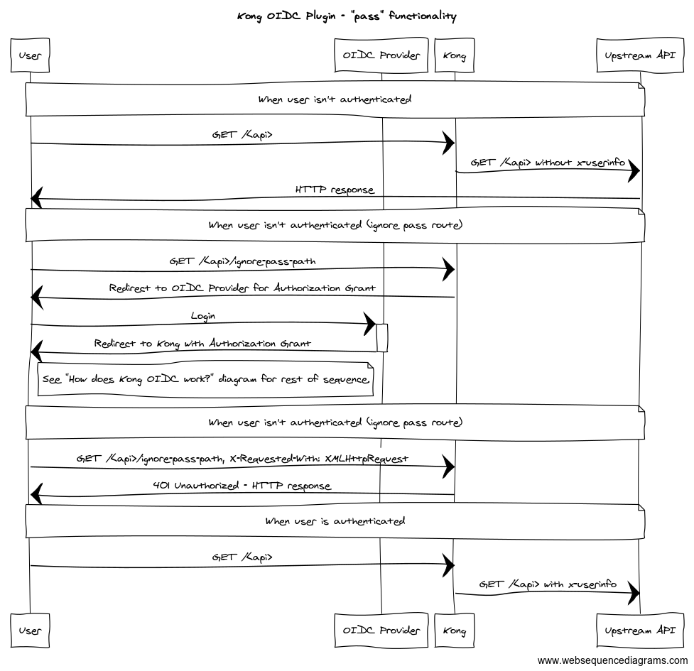

# What is Kong OIDC plugin

[](https://gitter.im/nokia/kong-oidc?utm_source=badge&utm_medium=badge&utm_campaign=pr-badge&utm_content=badge)

**Continuous Integration:** [](https://travis-ci.org/nokia/kong-oidc)
[](https://coveralls.io/github/nokia/kong-oidc?branch=master) <br/>

**kong-oidc** is a plugin for [Kong](https://github.com/Mashape/kong) implementing the
[OpenID Connect](http://openid.net/specs/openid-connect-core-1_0.html) Relying Party (RP) functionality.

It authenticates users against an OpenID Connect Provider using
[OpenID Connect Discovery](http://openid.net/specs/openid-connect-discovery-1_0.html)
and the Basic Client Profile (i.e. the Authorization Code flow).

It maintains sessions for authenticated users by leveraging `lua-resty-openidc` thus offering
a configurable choice between storing the session state in a client-side browser cookie or use
in of the server-side storage mechanisms `shared-memory|memcache|redis`.

It supports server-wide caching of resolved Discovery documents and validated Access Tokens.

It can be used as a reverse proxy terminating OAuth/OpenID Connect in front of an origin server so that
the origin server/services can be protected with the relevant standards without implementing those on
the server itself.

Introspection functionality add capability for already authenticated users and/or applications that
already posses acces token to go through kong. The actual token verification is then done by Resource Server.

## How does it work

The diagram below shows the message exchange between the involved parties.


For security purposes the following headers are stripped at the beginning of this plugins execution:
* `X-Access-Token`
* `X-ID-Token`
* `X-Userinfo`

These headers will only be appended to the requests if the user is authenticated or has a valid session.

The `X-Userinfo` header contains the payload from the Userinfo Endpoint

```
X-Userinfo: {"preferred_username":"alice","id":"60f65308-3510-40ca-83f0-e9c0151cc680","sub":"60f65308-3510-40ca-83f0-e9c0151cc680"}
```

The plugin also sets the `ngx.ctx.authenticated_consumer` variable, which can be using in other Kong plugins:
```
ngx.ctx.authenticated_consumer = {
    id = "60f65308-3510-40ca-83f0-e9c0151cc680",   -- sub field from Userinfo
    username = "alice"                             -- preferred_username from Userinfo
}
```

### XMLHttp/Ajax Requests

HTTP Requests made by client-side code (e.g ajax) should include the `X-Requested-With: XMLHttpRequest` header. 302 Redirects are replaced with 401 Unauthorized HTTP responses when this header is present AND the user is unauthenticated.

## Dependencies

**kong-oidc** depends on the following package:

- [`lua-resty-openidc`](https://github.com/pingidentity/lua-resty-openidc/)
  - [`lua-resty-session`](https://github.com/bungle/lua-resty-session)


## Installation

If you're using `luarocks` execute the following:

     luarocks install kong-oidc

You also need to set the `KONG_PLUGINS` environment variable

     export KONG_PLUGINS=oidc

### Caching

This plugin and `lua-resty-openidc` luarocks package utilizes the http `lua_shared_dict` directive for caching. Thus to utilize this plugin effectively, please review the following sample configurations for nginx:
* [https://github.com/zmartzone/lua-resty-openidc#sample-configuration-for-google-signin](https://github.com/zmartzone/lua-resty-openidc#sample-configuration-for-google-signin)
* [https://github.com/zmartzone/lua-resty-openidc#sample-configuration-for-pingfederate-oauth-20](https://github.com/zmartzone/lua-resty-openidc#sample-configuration-for-pingfederate-oauth-20)

For full support and functionality you should have a `lua_shared_dict` with the following names:
- introspection
- discovery
- jwks
- userinfo

## Usage

### Parameters

| Parameter                                   | Default                                  | Required | description                                                                                                                                                                                                                                                                         |
| ------------------------------------------- | ---------------------------------------- | -------- | ----------------------------------------------------------------------------------------------------------------------------------------------------------------------------------------------------------------------------------------------------------------------------------- |
| `name`                                      |                                          | true     | plugin name, has to be `oidc`                                                                                                                                                                                                                                                       |
| `config.client_id`                          |                                          | true     | OIDC Client ID                                                                                                                                                                                                                                                                      |
| `config.client_secret`                      |                                          | true     | OIDC Client secret                                                                                                                                                                                                                                                                  |
| `config.discovery`                          | https://.well-known/openid-configuration | true     | OIDC Discovery Endpoint (`/.well-known/openid-configuration`)                                                                                                                                                                                                                       |
| `config.discovery_override`                 |                                          | false    | This is a **map** type with multiple properties. See [Discovery Override](#discovery-override) below.                                                                                                                                                                               |
| `config.scope`                              | openid                                   | false    | OAuth2 Token scope. To use OIDC it has to contains the `openid` scope. Note if using `refresh_token` grant then include `offline_access` as a scope.                                                                                                                                |
| `config.ssl_verify`                         | false                                    | false    | Enable SSL verification to OIDC Provider                                                                                                                                                                                                                                            |
| `config.session_secret`                     |                                          | false    | Additional parameter, which is used to encrypt the session cookie. Needs to be random                                                                                                                                                                                               |
| `config.introspection_endpoint_auth_method` | client_secret_basic                      | false    | Token introspection auth method. resty-openidc supports `client_secret_(basic|post)`                                                                                                                                                                                                |
| `config.introspection_expiry_claim`         |                                          | false    | Claim name that will be checked to determine cache ttl                                                                                                                                                                                                                              |
| `config.introspection_cache_ignore`         | false                                    | false    | Forces cache to NOT be used                                                                                                                                                                                                                                                         |
| `config.introspection_interval`             |                                          | false    | TTL that can be used to overwrite token `expiry_claim` ttl (will only be used if shorter then `expiry_claim`)                                                                                                                                                                       |
| `config.timeout`                            |                                          | false    | OIDC endpoint calls timeout                                                                                                                                                                                                                                                         |
| `config.bearer_only`                        | no                                       | false    | Only introspect tokens without redirecting                                                                                                                                                                                                                                          |
| `config.realm`                              | kong                                     | false    | Realm used in WWW-Authenticate response header                                                                                                                                                                                                                                      |
| `config.logout_path`                        | /logout                                  | false    | Absolute path used to logout from the OIDC RP                                                                                                                                                                                                                                       |
| `config.redirect_uri`                       |                                          | true     | URI (absolute, e.g. http://website.com) to which authorization code is sent back from OIDC Provider                                                                                                                                                                                 |
| `config.prompt`                             |                                          | false    | Valid values include `none`, `login`, `consent` and/or `select_account`. Note if using `refresh_token` grant then `consent` is required. See [https://openid.net/specs/openid-connect-core-1_0.html#AuthRequest](https://openid.net/specs/openid-connect-core-1_0.html#AuthRequest) |
| `config.session`                            | `{ cookie = { samesite = 'Lax' }}`       | false    | See [OIDC Session Config](#oidc-session-config)                                                                                                                                                                                                                                     |
| `config.force_authentication_path`          |                                          | false    | See [force_authentication_path Parameter](#force_authentication_path-parameter)                                                                                                                                                                                                                       |

#### Discovery Override

The following properties should be used if the **Discovery Endpoint** of the OIDC IDP is not available and/or known.

The descriptions for the following parameters were referenced from the following websites:
* [OpenId.net](https://openid.net/specs/openid-connect-discovery-1_0.html#ProviderMetadata)
* [IdentityServer4](http://docs.identityserver.io/en/latest/index.html)
  * **Note:** this is not the standard creator for OIDC but does provide valid descriptions and detail regarding purpose of endpoints.

| Parameter                                 | Required | Description                                                                                                                                                                                                                                                                                                                                                                                                                                                                                                                                                                                                                                                                                                                                                                      |
| ----------------------------------------- | -------- | -------------------------------------------------------------------------------------------------------------------------------------------------------------------------------------------------------------------------------------------------------------------------------------------------------------------------------------------------------------------------------------------------------------------------------------------------------------------------------------------------------------------------------------------------------------------------------------------------------------------------------------------------------------------------------------------------------------------------------------------------------------------------------- |
| `config.discovery.authorization_endpoint` | true     | URL of the OP's OAuth 2.0 Authorization Endpoint.                                                                                                                                                                                                                                                                                                                                                                                                                                                                                                                                                                                                                                                                                                                                |
| `config.discovery.token_endpoint`         | true     | URL of the OP's OAuth 2.0 Token Endpoint. This is REQUIRED unless only the Implicit Flow is used.                                                                                                                                                                                                                                                                                                                                                                                                                                                                                                                                                                                                                                                                                |
| `config.discovery.userinfo_endpoint`      | true     | RECOMMENDED. URL of the OP's UserInfo Endpoint. This URL MUST use the https scheme and MAY contain port, path, and query parameter components.                                                                                                                                                                                                                                                                                                                                                                                                                                                                                                                                                                                                                                   |
| `config.discovery.jwks_uri`               | true     | REQUIRED. URL of the OP's JSON Web Key Set document. This contains the signing key(s) the RP uses to validate signatures from the OP. The JWK Set MAY also contain the Server's encryption key(s), which are used by RPs to encrypt requests to the Server. When both signing and encryption keys are made available, a use (Key Use) parameter value is REQUIRED for all keys in the referenced JWK Set to indicate each key's intended usage. Although some algorithms allow the same key to be used for both signatures and encryption, doing so is NOT RECOMMENDED, as it is less secure. The JWK x5c parameter MAY be used to provide X.509 representations of keys provided. When used, the bare key values MUST still be present and MUST match those in the certificate. |
| `config.discovery.revocation_endpoint`    | true     | This endpoint allows revoking access tokens (reference tokens only) and refresh token.                                                                                                                                                                                                                                                                                                                                                                                                                                                                                                                                                                                                                                                                                           |
| `config.discovery.issuer`                 | true     | REQUIRED. URL using the https scheme with no query or fragment component that the OP asserts as its Issuer Identifier. If Issuer discovery is supported, this value MUST be identical to the issuer value returned by WebFinger. This also MUST be identical to the iss Claim value in ID Tokens issued from this Issuer.                                                                                                                                                                                                                                                                                                                                                                                                                                                        |
| `config.discovery.introspection_endpoint` | false    | It can be used to validate reference tokens (or JWTs if the consumer does not have support for appropriate JWT or cryptographic libraries).                                                                                                                                                                                                                                                                                                                                                                                                                                                                                                                                                                                                                                      |
| `config.discovery.end_session_endpoint`   | false    | The end session endpoint can be used to trigger single sign-out.                                                                                                                                                                                                                                                                                                                                                                                                                                                                                                                                                                                                                                                                                                                 |

#### OIDC Session Config

This section details the supported configuration options for the OIDC session.

Note: the following parameter is NOT a flat configuration object (i.e YAML structure will need to be followed).

For example:

```YAML
config:
  session:
    cookie:
      samesite: 'Strict'
```

The following table documents the supported properties. If a non-supported property is supplied Kong will throw an error.

These properties are provided to `session.start(opts)`, for more information on the options see [lua-resty-session](https://github.com/bungle/lua-resty-session).

| Parameter                        | Required | Default | Description                                       |
| -------------------------------- | -------- | ------- | ------------------------------------------------- |
| `config.session.cookie.samesite` | false    | Lax     | Determines the value of the cookie SameSite flag. |

##### Why does kong-oidc use a session?

**kong-oidc** uses a resty library called `lua-resty-openidc` (see [Dependencies](#dependencies)). This library uses a session for storing various values during the authentication process for the [Authorization Code Flow](https://openid.net/specs/openid-connect-core-1_0.html#CodeFlowAuth). These values include the [following](https://github.com/zmartzone/lua-resty-openidc/blob/v1.7.2/lib/resty/openidc.lua#L349):
- original_url - Kong needs to remember after it authenticates you, where your original request was supposed to go.
- state - CSRF/XSRF mitigation
- nonce - Replay attack mitigation
- last_authenticated - used for silent reauthentication

#### force_authentication_path Parameter

By default, the **kong oidc** plugin prevents unauthenticated requests from reaching the upstream api. When the `force_authentication_path` parameter is set, the behavior is changed.

Setting the `force_authentication_path` parameter changes the plugin behavior to allow unauthenticated request to reach the upstream API. Unauthenticated requests will be proxied without `x-userinfo` headers. Authenticated requests will be proxied with `x-userinfo`.

The `force_authentication_path` variable should be a *string* relative url path value (e.g `/api/auth/login`). When a request is made to the defined path if the user is unauthenticated then the plugin will respond with a 302 HTTP status code to redirect the user to the IDP login page (authentication code flow).

The following diagram illustrates how the behavior of **kong-oidc** plugin when the parameter `force_authentication_path` is set.



### Enabling

To enable the plugin only for one API:

```
POST /apis/<api_id>/plugins/ HTTP/1.1
Host: localhost:8001
Content-Type: application/x-www-form-urlencoded
Cache-Control: no-cache

name=oidc&config.client_id=kong-oidc&config.client_secret=29d98bf7-168c-4874-b8e9-9ba5e7382fa0&config.discovery=https%3A%2F%2F<oidc_provider>%2F.well-known%2Fopenid-configuration
```

To enable the plugin globally:
```
POST /plugins HTTP/1.1
Host: localhost:8001
Content-Type: application/x-www-form-urlencoded
Cache-Control: no-cache

name=oidc&config.client_id=kong-oidc&config.client_secret=29d98bf7-168c-4874-b8e9-9ba5e7382fa0&config.discovery=https%3A%2F%2F<oidc_provider>%2F.well-known%2Fopenid-configuration
```

A successful response:
```
HTTP/1.1 201 Created
Date: Tue, 24 Oct 2017 19:37:38 GMT
Content-Type: application/json; charset=utf-8
Transfer-Encoding: chunked
Connection: keep-alive
Access-Control-Allow-Origin: *
Server: kong/0.11.0

{
    "created_at": 1508871239797,
    "config": {
        "response_type": "code",
        "client_id": "kong-oidc",
        "discovery": "https://<oidc_provider>/.well-known/openid-configuration",
        "scope": "openid",
        "ssl_verify": "no",
        "client_secret": "29d98bf7-168c-4874-b8e9-9ba5e7382fa0",
        "token_endpoint_auth_method": "client_secret_post"
    },
    "id": "58cc119b-e5d0-4908-8929-7d6ed73cb7de",
    "enabled": true,
    "name": "oidc",
    "api_id": "32625081-c712-4c46-b16a-5d6d9081f85f"
}
```

### Upstream API request

The plugin adds an additional `X-Userinfo`, `X-Access-Token` and `X-Id-Token` headers to the upstream request, which can be consumer by upstream server. Note if these headers were present in the request prior to the execution fo this plugin, then they will be removed/overwritten. All of them are base64 encoded:

```
GET / HTTP/1.1
Host: netcat:9000
Connection: keep-alive
X-Forwarded-For: 172.19.0.1
X-Forwarded-Proto: http
X-Forwarded-Host: localhost
X-Forwarded-Port: 8000
X-Real-IP: 172.19.0.1
Cache-Control: max-age=0
User-Agent: Mozilla/5.0 (Windows NT 10.0; Win64; x64) AppleWebKit/537.36 (KHTML, like Gecko) Chrome/61.0.3163.100 Safari/537.36
Upgrade-Insecure-Requests: 1
Accept: text/html,application/xhtml+xml,application/xml;q=0.9,image/webp,image/apng,*/*;q=0.8
Accept-Encoding: gzip, deflate
Accept-Language: pl-PL,pl;q=0.8,en-US;q=0.6,en;q=0.4
Cookie: session=KOn1am4mhQLKazlCA.....
X-Userinfo: eyJnaXZlbl9uYW1lIjoixITEmMWaw5PFgcW7xbnEhiIsInN1YiI6ImM4NThiYzAxLTBiM2ItNDQzNy1hMGVlLWE1ZTY0ODkwMDE5ZCIsInByZWZlcnJlZF91c2VybmFtZSI6ImFkbWluIiwibmFtZSI6IsSExJjFmsOTxYHFu8W5xIYiLCJ1c2VybmFtZSI6ImFkbWluIiwiaWQiOiJjODU4YmMwMS0wYjNiLTQ0MzctYTBlZS1hNWU2NDg5MDAxOWQifQ==
X-Access-Token: eyJhbGciOiJSUzI1NiIsInR5cCIgOiAiSldUIiwia2lkIiA6ICJGenFSY0N1Ry13dzlrQUJBVng1ZG9sT2ZwTFhBNWZiRGFlVDRiemtnSzZRIn0.eyJqdGkiOiIxYjhmYzlkMC1jMjlmLTQwY2ItYWM4OC1kNzMyY2FkODcxY2IiLCJleHAiOjE1NDg1MTA4MjksIm5iZiI6MCwiaWF0IjoxNTQ4NTEwNzY5LCJpc3MiOiJodHRwOi8vMTkyLjE2OC4wLjk6ODA4MC9hdXRoL3JlYWxtcy9tYXN0ZXIiLCJhdWQiOlsibWFzdGVyLXJlYWxtIiwiYWNjb3VudCJdLCJzdWIiOiJhNmE3OGQ5MS01NDk0LTRjZTMtOTU1NS04NzhhMTg1Y2E0YjkiLCJ0eXAiOiJCZWFyZXIiLCJhenAiOiJrb25nIiwibm9uY2UiOiJmNGRkNDU2YzBjZTY4ZmFmYWJmNGY4ZDA3YjQ0YWE4NiIsImF1dGhfdGltZSI6…IiwibWFuYWdlLWFjY291bnQtbGlua3MiLCJ2aWV3LXByb2ZpbGUiXX19LCJzY29wZSI6Im9wZW5pZCBwcm9maWxlIGVtYWlsIiwiZW1haWxfdmVyaWZpZWQiOmZhbHNlLCJwcmVmZXJyZWRfdXNlcm5hbWUiOiJhZG1pbiJ9.GWuguFjSEDGxw_vbD04UMKxtai15BE2lwBO0YkSzp-NKZ2SxAzl0nyhZxpP0VTzk712nQ8f_If5-mQBf_rqEVnOraDmX5NOXP0B8AoaS1jsdq4EomrhZGqlWmuaV71Cnqrw66iaouBR_6Q0s8bgc1FpCPyACM4VWs57CBdTrAZ2iv8dau5ODkbEvSgIgoLgBbUvjRKz1H0KyeBcXlVSgHJ_2zB9q2HvidBsQEIwTP8sWc6er-5AltLbV8ceBg5OaZ4xHoramMoz2xW-ttjIujS382QQn3iekNByb62O2cssTP3UYC747ehXReCrNZmDA6ecdnv8vOfIem3xNEnEmQw
X-Id-Token: eyJuYmYiOjAsImF6cCI6ImtvbmciLCJpYXQiOjE1NDg1MTA3NjksImlzcyI6Imh0dHA6XC9cLzE5Mi4xNjguMC45OjgwODBcL2F1dGhcL3JlYWxtc1wvbWFzdGVyIiwiYXVkIjoia29uZyIsIm5vbmNlIjoiZjRkZDQ1NmMwY2U2OGZhZmFiZjRmOGQwN2I0NGFhODYiLCJwcmVmZXJyZWRfdXNlcm5hbWUiOiJhZG1pbiIsImF1dGhfdGltZSI6MTU0ODUxMDY5NywiYWNyIjoiMSIsInNlc3Npb25fc3RhdGUiOiJiNDZmODU2Ny0zODA3LTQ0YmMtYmU1Mi1iMTNiNWQzODI5MTQiLCJleHAiOjE1NDg1MTA4MjksImVtYWlsX3ZlcmlmaWVkIjpmYWxzZSwianRpIjoiMjI1ZDRhNDItM2Y3ZC00Y2I2LTkxMmMtOGNkYzM0Y2JiNTk2Iiwic3ViIjoiYTZhNzhkOTEtNTQ5NC00Y2UzLTk1NTUtODc4YTE4NWNhNGI5IiwidHlwIjoiSUQifQ==
```


## Development

The following references are useful to those that are new to kong plugin development:
* [https://docs.konghq.com/1.5.x/plugin-development/file-structure/](https://docs.konghq.com/1.5.x/plugin-development/file-structure/)
* [https://docs.konghq.com/1.5.x/plugin-development/custom-logic/](https://docs.konghq.com/1.5.x/plugin-development/custom-logic/)

### Running Unit Tests

To run unit tests, run the following command:

```
./bin/run-unit-tests.sh
```

This may take a while for the first run, as the docker image will need to be built, but subsequent runs will be quick.


### Building the Integration Test Environment

To build the integration environment (Kong with the oidc plugin enabled, and Keycloak as the OIDC Provider), you will first need to find your computer's IP, and assign that to the environment variable `IP`. Finally, you will run the `./bin/build-env.sh` command. Here's an example:

```
export IP=192.168.0.1
./bin/build-env.sh
```

To tear the environment down:

```
./bin/teardown-env.sh
```

## Roadmap

### Supporting Multiple IDPS

The following is pseudocode/pseudo-schema for the ability to handle mutiple identity providers:
```
    - name: oidc
      config:
        logout_path: /echo_service/api/logout
        redirect_uri: http://localhost:8000/echo_service/api/custom-oidc-cb
        redirect_after_logout_uri: http://localhost:8000/echo_service/public/logout
        idp_host_header_prop: sky_host
        configs:
          custom-oidc.com:
            introspection_endpoint_auth_method: client_secret_post
            scope: "openid offline_access"
            prompt: consent
            token_endpoint_auth_method: client_secret_post
            client_id: foo
            client_secret: bar
            discovery:
            - protocol: https
            - port: 9002
            - path: .well-known/openid-configuration
            # - uri: http://custom-oidc:9002/.well-known/openid-configuration
```
